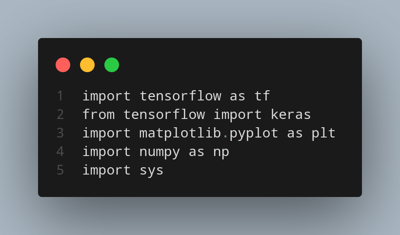
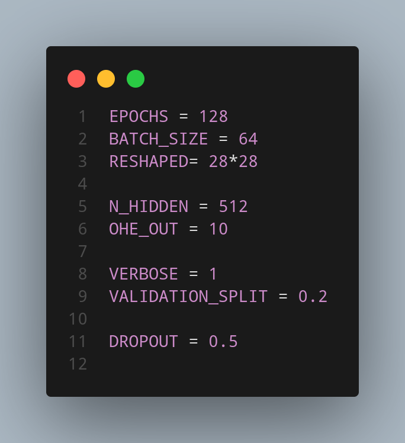
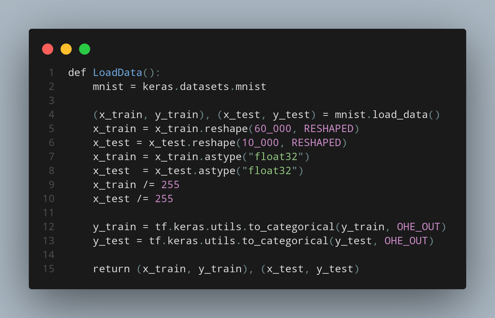
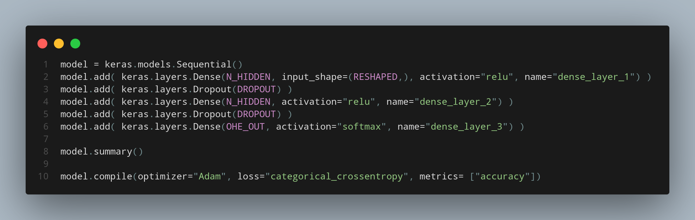
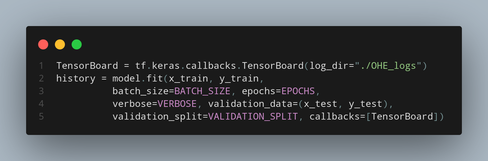
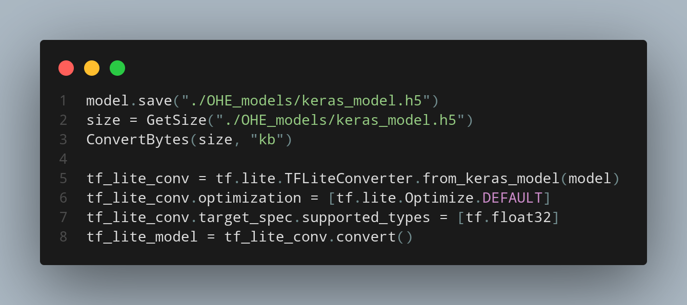
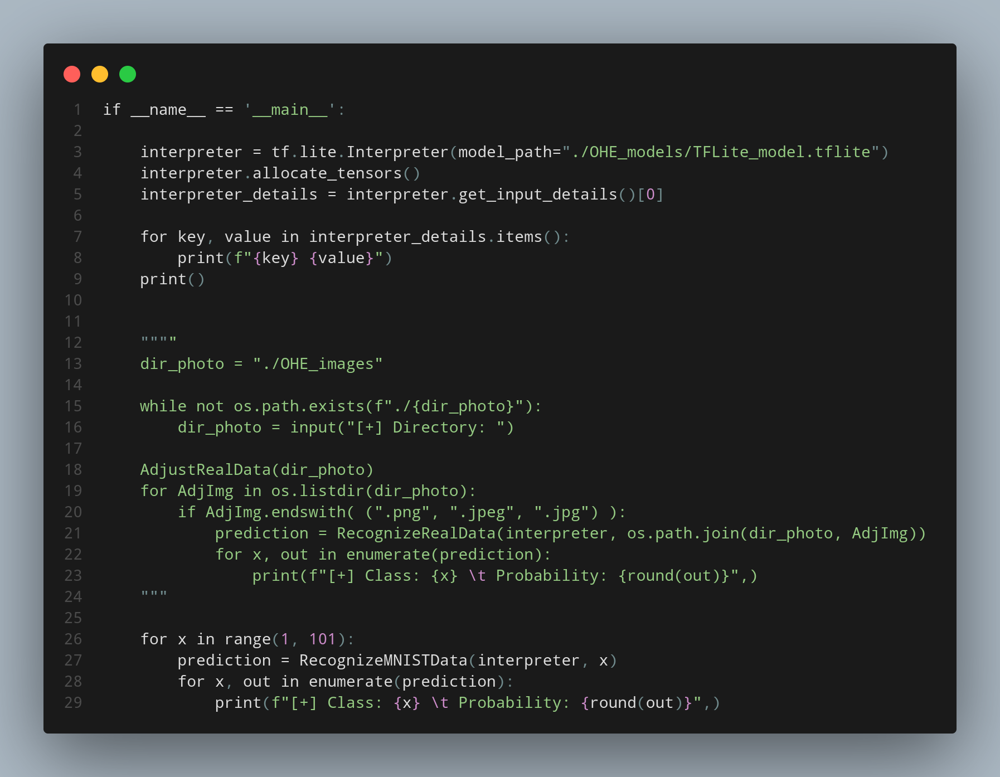

# TensorFlow – One Hot Encoding

  
# 🇬🇧 **INTRO**

I have always been deeply fascinated by the world of _Artificial Intelligence_, especially its branches in _Machine Learning_ and _Deep Learning_.  
For this reason, I decided to begin my learning journey with one of the most flexible and powerful libraries in terms of portability and efficiency: **TensorFlow**.

In this project, I developed a simple **digit-recognition model** that uses **One Hot Encoding** to represent numerical classes.  
One Hot Encoding is a technique that converts each class into a binary vector in which **one element is equal to 1** and all others are 0.  
This representation makes the model’s predictions easy to interpret and particularly suitable for classification tasks.

Below, I will walk through the structure of the code, the preprocessing pipeline, model configuration, training, and final results.

---

  

The first step is importing all the necessary libraries, including:

1. **TensorFlow**
    
2. **Keras**
    
3. **MatPlotLib**
    
4. **NumPy**
    
5. **System** (optional)

These ensure proper data handling, model creation, visualization, and export functionalities.

---

  

After the imports, we define the hyperparameters that will be used by the model:

- **EPOCHS**: number of full training iterations
    
- **BATCH_SIZE**: number of samples processed before updating the weights
    
- **RESHAPED**: the reshaped input size of the images
    
- **N_HIDDEN**: number of neurons in the hidden layers
    
- **OHe_OUT**: number of output classes (One Hot Encoded)
    
- **VERBOSE**: level of detail printed during training
    
- **VALIDATION_SPLIT**: percentage of the dataset used for validation
    
- **DROPOUT**: percentage of neurons randomly deactivated during training
    

Correct hyperparameter tuning is crucial to balance performance, training time, and generalization ability.

---

We then define the function responsible for loading and preprocessing the **MNIST** dataset.  
Organizing this logic inside a function helps keep the code clean and modular.

  

During this step, the script will:

1. Split the dataset into **TRAIN** and **TEST** sets
    
2. Resize and normalize the images
    
3. Convert the data into **Float32 arrays**, optimal for TensorFlow processing

---

  

The model consists of a sequence of fully connected (**Dense**) layers, each containing **512 neurons**.  A **Dropout** layer is added to help prevent overfitting by randomly disabling a percentage of neurons during training. This improves the model’s ability to generalize and reduces reliance on specific patterns in the training data.

---

We then move on to the actual training phase and the model-export process.

  
    
  

Once training is completed, the model can be saved both in **H5 format** (standard Keras format) and **TFLite format**, which is ideal for mobile devices, embedded systems, and lightweight applications.

---

# RESULTS

## **Accuracy**

  

## **Loss**

  

---

# NOTES

To test the project, simply run the **_visualizer.py_** script.  
If you wish to use a **camera** instead of a preloaded image set, uncomment the section of code shown below (and comment out the default one).

  

 
# 🇮🇹 INTRO

Sono sempre stato molto appassionato del mondo dell’_Artificial Intelligence_, in particolare delle sue ramificazioni nel _Machine Learning_ e nel _Deep Learning_. Per questo ho deciso di iniziare il mio percorso con una delle librerie più flessibili in termini di portabilità ed efficienza: **TensorFlow**, sviluppando un semplice modello di _digit recognition_ che utilizza il _One Hot Encoding_.

Un algoritmo di _One Hot Encoding_ non è altro che una tecnica che, dopo la trasformazione dei dati, permette di rappresentare ciascuna classe come un array di valori binari, in cui un solo elemento è pari a 1 mentre tutti gli altri sono pari a 0. Grazie a ciò, possiamo ricavare il risultato ottenuto dal modello in maniera facile ed efficace. Vediamo adesso la struttura del codice.

---

	 

Per prima cosa importiamo tutte le librerie con cui lavoreremo, tra cui:

1. **TensorFlow**
    
2. **Keras**
    
3. **MatPlotLib**
    
4. **NumPy**
    
5. **System** (opzionale)

--- 

	 

Dopo aver importato le librerie necessarie, specifichiamo i parametri che verranno poi passati all'algoritmo:

- **EPOCHS**: numero di iterazioni complete sul dataset
    
- **BATCH_SIZE**: numero di campioni utilizzati per ogni aggiornamento dei pesi
    
- **RESHAPED**: dimensione della forma in cui verranno trasformati i dati in input
    
- **N_HIDDEN**: numero di neuroni nel livello nascosto
    
- **OHe_OUT**: numero di classi da codificare tramite One Hot Encoding
    
- **VERBOSE**: livello di dettaglio nei log durante l’addestramento
    
- **VALIDATION_SPLIT**: percentuale di dati da usare come set di validazione
    
- **DROPOUT**: percentuale di neuroni da disattivare per prevenire overfitting

---
Successivamente scriviamo il codice necessario per caricare, da un dataset già esistente (_MNIST_), i parametri e i dati che utilizzeremo nella fase di allenamento del modello. Il tutto viene inserito all’interno di una funzione per rendere il codice più ordinato e modulare.

	 

In questa fase andremo a:

1. Suddividere il dataset in **TRAIN** e **TEST** (80% vs 20%)
    
2. Ridimensionare le immagini presenti nei due dataset
    
3. Convertire i dati in un formato utilizzabile dal modello (array di **Float32**)

---

	 

Il modello sarà composto da un’alternanza di livelli completamente connessi (_Dense Layers_), ciascuno con **512 neuroni**. Grazie al livello di **Dropout** possiamo disattivare casualmente una percentuale di neuroni durante l’allenamento, migliorando la capacità del modello di generalizzare ed evitando fenomeni di overfitting. Passiamo infine, alla fase di allenamento effettivo e conversione

---

	 

  

	 

Alla fine di ciò, il modello sarà finalmente utilizzabile. sia sottoforma di formato _H5_ (binario) che _.tflit_ (tensorflow lite). Ecco qui i risultati dell'allenamento:

---
## ACCURATEZZA 

	 

 
## PERDITA 

	 

# P. S.

Per poter testare il progetto è sufficiente eseguire il programma **_visualizer.py_**. Qualora si desideri utilizzare la **telecamera** invece di un set di immagini preimportate, basterà rimuovere la parte commentata del seguente codice (e commentare quella predefinita).

	 

